# 🛡️ AEGIS — Zero-Trust AI Security Platform

<div align="center">
  


**Real-time OS monitoring • AI anomaly detection • ZK-SNARK authentication • Tamper-proof audit chain**

</div>

---

## 📖 Overview

AEGIS is a next-generation security platform engineered to provide comprehensive, zero-trust infrastructure protection. It watches your operating system at the kernel level using eBPF, learns normal user behavior via an advanced **LSTM Autoencoder** neural network, and detects sophisticated anomalies in real-time. 

Furthermore, AEGIS enforces stringent cryptographic security: it authenticates users entirely passwordlessly using **Zero-Knowledge Proofs (ZK-SNARKs)** and records every security event in a tamper-proof, append-only **SHA-256 hash chain**.

---

## 🏗️ Architectural Domains

AEGIS unifies four complex technology domains into a single resilient security product:

| Domain | Technology Stack | Purpose & Implementation |
|--------|-----------------|--------------------------|
| **Operating System** | eBPF + BCC + Python | Kernel-level deep packet and syscall inspection. Captures file access, process execution, and network connections invisibly. |
| **Artificial Intelligence** | PyTorch LSTM Autoencoder | Behavioral anomaly detection trained on local telemetry. Avoids signature-based blind spots by understanding "normal". |
| **Cryptography** | ZK-SNARKs (circom) + SHA-256 | Privacy-preserving passwordless authentication. Cryptographically guarantees log integrity (WORM compliance). |
| **Web Technology** | React 18 + FastAPI + WebSocket | High-performance, real-time command center interface with asynchronous event streaming. |

---

## 🔄 System Sequence Diagram

The following sequence diagram details the full data flow—from kernel-level event capture up to the end-user dashboard presentation, including the Zero-Knowledge authentication phase.

```mermaid
sequenceDiagram
    participant OS as Linux Kernel
    participant Agent as eBPF Agent
    participant Backend as FastAPI Server
    participant AI as PyTorch Engine
    participant Crypto as Audit Chain
    participant DB as Supabase (PostgreSQL)
    participant UI as React Dashboard
    participant ZK as ZK-SNARK Prover

    %% Authentication Phase
    rect rgb(20, 25, 35)
    note right of ZK: Passwordless ZK-SNARK Authentication
    UI->>ZK: User enters ID + Secret
    ZK->>UI: Generate ZK Proof (circom/snarkjs)
    UI->>Backend: POST /api/auth/login (Proof)
    Backend->>Backend: Verify ZK Proof & Signals
    Backend->>DB: Fetch Authenticated User
    DB-->>Backend: User Data
    Backend-->>UI: JWT Token & Connection Authorized
    end

    %% Threat Detection Pipeline
    rect rgb(35, 20, 30)
    note right of OS: Real-Time Threat Detection & Audit Pipeline
    OS->>Agent: Syscalls (File/Network/Process)
    Agent->>Agent: Batch & Format to JSON
    Agent->>Backend: POST /api/events (Telemetry Payload)
    
    par AI Scoring & Hash Chaining
        Backend->>AI: Analyze Event Data
        AI-->>Backend: Anomaly Score (0-100) & Classification
    and
        Backend->>Crypto: Compute SHA-256 Hash
        Crypto-->>Backend: Cryptographic Signature
    end

    Backend->>DB: Store Event + Threat Score + Hash Signature
    DB-->>Backend: Acknowledgment
    
    Backend->>UI: Broadcast via WebSocket (Live Stream)
    UI->>UI: Update Threat Gauge & Alert Feed
    end
```



---

## 🔐 Core Features Deep Dive

### 1. ZK-SNARK Passwordless Authentication
Eliminate credential stuffing and password theft. Users authenticate by proving they possess a secret without ever transmitting the secret itself. Powered by `circom` and `snarkjs` using Poseidon hashing.

### 2. LSTM Autoencoder Threat Engine
Traditional antiviruses use static signatures. AEGIS uses a local PyTorch model to learn the specific baseline behavior of your machine. It detects zero-day attacks by recognizing when system behavior statistically deviates from the norm.

### 3. eBPF Kernel-Level Telemetry
Operates entirely in kernel space (like Cloudflare and Meta infrastructure tools). AEGIS intercepts syscalls before they reach user space, making it virtually impossible for malware to hide file executions or unauthorized network sockets.

### 4. Tamper-Proof Cryptographic Audit Trail
Every detected event is linked to the previous event via a cryptographic SHA-256 hash. If an attacker attempts to delete or alter a past log in the database, the hash chain breaks, immediately flagging the database as compromised.

---

## 🛠️ Comprehensive Tech Stack

- **System Level:** Python 3.10, BCC, eBPF
- **Machine Learning:** PyTorch, NumPy, Scikit-learn
- **Cryptography:** circom, snarkjs, AES-256 (Fernet), SHA-256
- **Backend API:** FastAPI, Uvicorn, Pydantic, WebSockets
- **Frontend UI:** React 18, TypeScript, Vite, TailwindCSS (optional integration)
- **Database:** Supabase (PostgreSQL)
- **Infrastructure:** Docker, Docker Compose, WSL2

---

## 🚀 Installation & Deployment

### Prerequisites
- Linux or **WSL2** (Ubuntu recommended for Windows users)
- Python 3.10+
- Node.js 18+
- Docker & Docker Compose (Optional but recommended)

### Quick Start (Local Development)

```bash
# 1. Clone the repository
git clone https://github.com/yourusername/aegis.git
cd aegis

# 2. Automated WSL2 Setup
chmod +x scripts/setup_wsl.sh
./scripts/setup_wsl.sh
```

### Manual Service Startup

To run the platform services manually, you need three terminal instances:

```bash
# Terminal 1: Core Backend & API
cd backend
pip install -r requirements.txt
cp .env.example .env # Configure Supabase keys
uvicorn main:app --reload --port 8000

# Terminal 2: eBPF Monitoring Agent (Requires Root/Sudo)
cd agent
pip install -r requirements.txt
sudo python3 agent.py

# Terminal 3: React Dashboard
cd frontend
npm install
cp .env.example .env
npm run dev
```

Navigate to **http://localhost:5173** to access the dashboard. 

> **Note:** You can run the backend and frontend without the eBPF agent using the built-in demo event generator.

---

## 🧠 AI Model Training

Train the LSTM Autoencoder to your machine's baseline:

```bash
# Generate synthetic baseline data (for testing)
python3 scripts/train_model.py --generate 1000

# Train the model on real captured system data
python3 scripts/train_model.py agent/baseline_events.json
```

---

## 📡 API Reference

| Method | REST Endpoint | Functionality |
|--------|--------------|---------------|
| `POST` | `/api/auth/register` | Register identity using ZK public hash |
| `POST` | `/api/auth/login` | Authenticate using ZK zero-knowledge proof |
| `POST` | `/api/events` | Ingest telemetry from eBPF agent |
| `GET` | `/api/events/recent` | Retrieve latest 100 system events |
| `GET` | `/api/events/stats` | Aggregate statistics for analytics |
| `GET` | `/api/audit` | Fetch cryptographic audit logs |
| `GET` | `/api/audit/verify/chain` | Run validation on the SHA-256 log chain |
| `WS` | `/ws/events` | Real-time bidirectional event streaming |

---

## 📁 Repository Architecture

```text
aegis/
├── agent/                    # eBPF Kernel-space monitor (Linux)
│   ├── agent.py              # Main BCC hook script
│   ├── collector.py          # Ring-buffer & telemetry aggregation
│   └── sender.py             # HTTP dispatcher
├── backend/                  # FastAPI Core Server
│   ├── ai/                   # PyTorch LSTM Engine & training logic
│   ├── api/                  # REST & WebSocket controllers
│   ├── crypto/               # ZK verifiers & hash chain logic
│   ├── db/                   # Supabase ORM/Clients
│   └── main.py               # Uvicorn entry point
├── frontend/                 # React 18 Dashboard
│   ├── src/components/       # Real-time ThreatFeed & Visualizations
│   ├── src/hooks/            # useWebSocket & useZKAuth custom hooks
│   └── src/pages/            # Dashboard, Audit, Login interfaces
├── zk/                       # Zero-Knowledge Circuit Definitions
│   └── circuit.circom        # Poseidon hash proving circuits
└── scripts/                  # CI/CD and Bootstrapping utilities
```

---

## 🐳 Containerization

AEGIS is fully dockerized for cloud deployments (Render, AWS, DigitalOcean).

```bash
# Build and orchestrate all services via Docker Compose
docker-compose up --build -d
```

---

## 📄 License & Attribution

Released under the **MIT License**.  
Engineered for advanced cybersecurity research, zero-trust infrastructure paradigms, and portfolio demonstration.

---

<div align="center">
  <b>Architected with Zero-Trust Principles</b><br>
  Python · PyTorch · circom · snarkjs · FastAPI · React · Supabase · eBPF
</div>
