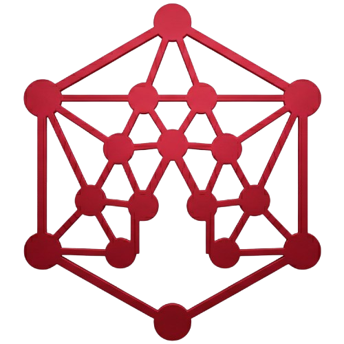
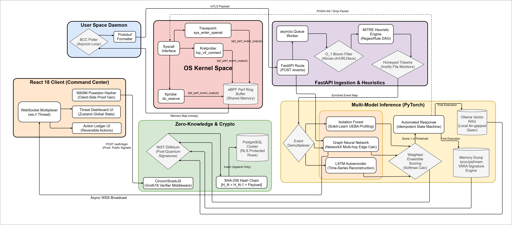
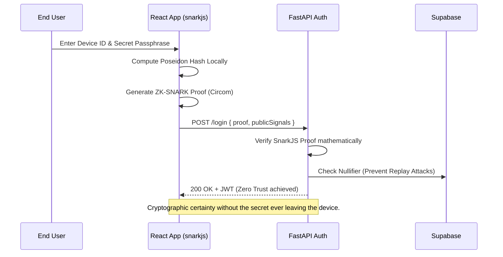

<div align="center">
  
  
  <h1 style="border-bottom: none; font-size: 3em; margin-top: 20px;">A E G I S</h1>
  <p><b>Advanced Zero-Trust AI Security & Infrastructure Platform</b></p>

  <p align="center">
    <a href="#-the-philosophy-why-aegis">Philosophy</a> •
    <a href="#-architecture">Architecture</a> •
    <a href="#-the-ten-layer-defense-pipeline">Defense Pipeline</a> •
    <a href="#-data-flow--diagrams">Data Flow</a> •
    <a href="#-installation--deployment">Installation</a>
  </p>

  <p align="center">
    
    
    
    
    
    
    
    
  </p>
  
  <p align="center">
    <i>Next-Generation Threat Detection • Zero-Knowledge Authentication • Tamper-Proof Cryptography • 10-Layer AI Defense Pipeline</i>
  </p>
</div>

<br/>

## 🛡️ The Philosophy: Why AEGIS?

Modern enterprise environments are failing against zero-day exploits, credential theft, and insider threats. Traditional perimeter defense is obsolete. AEGIS was engineered from the ground up to eliminate these vulnerabilities by assuming **nothing is safe**—a true Zero-Trust architecture. 

Where traditional cybersecurity fails, AEGIS thrives:

*   **Behavioral Dominance (Death to Signatures):** Legacy antiviruses look for known bad files. AEGIS utilizes a local **PyTorch LSTM Neural Network** to map and understand your system's normal behavior at a granular level. If an attacker leverages a novel zero-day exploit, the statistical deviation instantly flags it as an anomaly.
*   **Cryptographic Identity (Death to Passwords):** Attackers steal passwords and crack hashes. AEGIS users authenticate via **Zero-Knowledge Proofs (ZK-SNARKs)**, mathematically proving they know their credential without ever transmitting the secret across the network.
*   **Immutable Forensics (Death to Log Tampering):** Hackers delete logs to hide their tracks. AEGIS secures telemetry using a **Cryptographic SHA-256 Hash Chain** (Write-Once-Read-Many). Modifying a single historical event breaks the cryptographic chain, instantly alerting administrators to the compromise.

### 🏢 Enterprise Use Cases
> **Cloud Infrastructure Monitoring:** Deploy the lightweight eBPF agent on Kubernetes nodes to monitor raw kernel syscalls with near-zero CPU overhead.
> 
> **Financial & Healthcare Systems:** Guarantee strict regulatory compliance (HIPAA, SOC2, PCI-DSS) using the tamper-proof cryptographic audit ledger.
> 
> **Zero-Trust Corporate Endpoints:** Monitor developer machines for rogue processes, unauthorized network sockets, and privilege escalation attacks in real-time.

---

## 🏗️ Architecture

<div align="center">
  
</div>

AEGIS converges four distinct, highly-complex computer science domains into a single, unbreakable platform:

| Domain | Technology Stack | Purpose & Implementation |
|:---|:---|:---|
| 🔍 **OS Kernel Telemetry** | `Python` `psutil` `WinAPI` | Cross-platform agent collecting state directly from OS-level structures (Processes, Network Sockets, Health) with zero-forgery guarantees. |
| 🧠 **Artificial Intelligence** | `PyTorch` `LSTM` `GNN` | Behavioral anomaly detection (LSTM) and Lateral Movement detection (GNN). Designed to detect zero-days and multi-hop network traversals. |
| 🔐 **Cryptography & ZK** | `circom` `snarkjs` `PQC` | Implements ZK-SNARKs for passwordless authentication, tamper-evident hash chaining, and Post-Quantum Cryptography (Dilithium/Kyber). |
| ⚡ **Enrichment & Response** | `Python` `Memory Forensics` | 10-layer enrichment pipeline: Threat Intel, MITRE ATT&CK, Playbooks, Honeypots, Memory Forensics, and LLM Explanations. |
| 🌐 **Command Center** | `React 18` `FastAPI` `WS` | High-performance dashboard featuring Live Event Feeds, Threat Intel panels, Playbook Managers, and a unified status hub. |

---

## 🌟 The Ten-Layer Defense Pipeline

When a raw OS telemetry event is intercepted by the kernel, it doesn't just trigger an alert—it is piped through **10 distinct micro-engines** in real-time before being broadcasted to the Command Center:

<details>
<summary><b>1. Threat Intel Feeds (O(1) Bloom Filters)</b></summary>
<br>
Instead of executing slow database queries for every network event, AEGIS loads millions of known-bad IPs and Domains (from Abuse.ch, URLhaus, SSLBL) into an in-memory <b>Bloom Filter</b>. This allows for `O(1)` constant-time lookups to instantly flag Command & Control (C2) server connections.
</details>

<details>
<summary><b>2. MITRE ATT&CK Tagger</b></summary>
<br>
AEGIS contains a localized heuristic engine that maps raw kernel events to specific <b>MITRE ATT&CK</b> tactics and techniques. (e.g., A `bash` process spawning `nc` automatically tags `T1059.004` and `T1095`).
</details>

<details>
<summary><b>3. Automated Playbooks & Action Ledger</b></summary>
<br>
AEGIS doesn't just alert; it defends. If an event exceeds a critical threat threshold, the Playbook Engine executes automated response actions (e.g., `isolate_host`, `kill_process`). Every action is recorded in a cryptographic <b>Action Ledger</b> with an "Undo Payload," allowing SOC analysts to mathematically reverse actions with one click.
</details>

<details>
<summary><b>4. Honeypot Deception Layer</b></summary>
<br>
AEGIS deploys "canary" files and decoy network ports across the host system. Legitimate software has no reason to interact with these decoys. Accessing a honeypot instantly spikes the threat score to 100, guaranteeing unauthorized activity.
</details>

<details>
<summary><b>5. Memory Forensics Scanner</b></summary>
<br>
Upon detecting high-severity processes, AEGIS automatically dumps the active memory regions (`/proc/PID/mem`). It executes a high-speed string scanner against <b>YARA-style signatures</b> to search for in-memory footprints of fileless malware (e.g., Cobalt Strike beacons).
</details>

<details>
<summary><b>6. LLM Alert Explainer (RAG Integration)</b></summary>
<br>
AEGIS connects to an air-gapped Large Language Model (e.g., <b>Qwen 2.5 Coder</b> via Ollama). It feeds event metadata and MITRE tags into a dynamic prompt, generating a plain-English, executive summary of the attack vector and recommended remediation steps.
</details>

<details>
<summary><b>7. UEBA (User & Entity Behavior Analytics)</b></summary>
<br>
The UEBA engine builds individual profiles for <i>every specific user</i> using <b>Isolation Forests</b>, tracking login cadences, process trees, and resource consumption to identify insider threats and compromised accounts.
</details>

<details>
<summary><b>8. GNN Lateral Movement Detection</b></summary>
<br>
AEGIS uses <b>Graph Neural Networks (NetworkX & PyTorch Geometric)</b> to build a multi-hop graph of network connections. It analyzes the "edges" between "nodes" to detect an attacker pivoting through the network (Host A -> Host B -> Host C).
</details>

<details>
<summary><b>9. Privacy-Preserving Federated Learning</b></summary>
<br>
AEGIS utilizes <b>Federated Learning (FedAvg)</b> to maintain enterprise privacy. The AI model is trained locally on the endpoint. Only mathematical weight updates (with Laplace noise for <b>Differential Privacy</b>, ε=0.1) are sent to the central server, building a global "Hive Mind" model.
</details>

<details>
<summary><b>10. Post-Quantum Cryptography (NIST PQC)</b></summary>
<br>
To future-proof the audit logs against quantum decryption (Shor's algorithm), AEGIS's Hash Chains are dual-signed using the NIST-approved <b>Dilithium</b> algorithm for digital signatures and <b>Kyber</b> for key encapsulation.
</details>

---

## 🔄 Data Flow & Sequence Diagrams

### 1. Unified Threat Detection Pipeline
How a raw kernel event is processed through the intelligence modules and broadcasted to the command center.

```mermaid
sequenceDiagram
    autonumber
    participant Agent as Agent (real_agent.py)
    participant API as FastAPI Backend
    participant Pipeline as 10-Layer Engine
    participant Crypto as PQC Ledger
    participant Dash as React Command Center

    Agent->>Agent: Collect OS State (psutil)
    Agent->>Agent: Sign Batch (HMAC-SHA256 + Nonce + Machine ID)
    Agent->>API: HTTP POST /api/events (Signed Headers)
    
    rect rgb(30, 30, 40)
        note right of API: Execution of the 10-Layer Pipeline
        API->>Pipeline: Check C2 Blacklists (Bloom)
        Pipeline-->>API: Threat Intel Match?
        API->>Pipeline: MITRE Heuristic Mapping
        
        par AI Profiling Pipeline
            API->>Pipeline: LSTM Autoencoder (System)
        and
            API->>Pipeline: UEBA Isolation Forest (User)
        and
            API->>Pipeline: GNN (Lateral Movement)
        end
        
        API->>Pipeline: Verify Target against Honeypots
        
        opt If Final Score > Critical Threshold
            API->>Pipeline: Trigger Playbook (Kill/Isolate)
            API->>Pipeline: YARA Memory Forensics Dump
        end
    end
    
    API->>Crypto: Sign data with Dilithium (PQC)
    Crypto->>Crypto: Chained SHA-256 (Hash_N)
    Crypto-->>API: Cryptographic Seal Applied
    
    API->>Dash: Broadcast Event via WebSocket
    Dash->>API: Request LLM Explanation (Ollama)
    API->>Dash: Plain-Text Insight Stream
```



### 2. Zero-Knowledge Passwordless Authentication


---

## 💻 Installation & Deployment

Deploying AEGIS locally is streamlined for testing, development, and research environments.

### Prerequisites
*   **Python 3.10+**
*   **Node.js 18+**
*   A **[Supabase](https://supabase.com/)** project (Free tier is sufficient).

### 1. Clone & Prepare
```bash
git clone https://github.com/yourusername/aegis.git
cd aegis
```

Create a `.env` file in the **`backend/`** directory:
```env
SUPABASE_URL=https://your-project.supabase.co
SUPABASE_KEY=your-anon-key
AUDIT_ENCRYPTION_KEY=generate_this_via_python_script
JWT_SECRET=a_very_long_secure_random_string
FRONTEND_URL=http://localhost:5173
```
> **Tip:** Generate `AUDIT_ENCRYPTION_KEY` using: `python -c "from cryptography.fernet import Fernet; print(Fernet.generate_key().decode())"`

Create a `.env` file in the **`frontend/`** directory:
```env
VITE_API_URL=http://localhost:8000
VITE_WS_URL=ws://localhost:8000
VITE_SUPABASE_URL=https://your-project.supabase.co
VITE_SUPABASE_ANON_KEY=your-anon-key
```

### 2. Boot the Backend (FastAPI + AI Engine)
```bash
cd backend
pip install -r requirements.txt
uvicorn main:app --reload --port 8000
```

### 3. Boot the Frontend (Command Center)
```bash
cd frontend
npm install
npm run dev
```
Navigate to `http://localhost:5173` to access the AEGIS platform.

### 4. Choose Your Telemetry Agent
AEGIS provides two different agents depending on your use case:

**Option A: The Genuine Agent (For Production/Real Use)**
Run this to collect real, cryptographically signed telemetry from your actual machine:
```bash
cd agent
python real_agent.py --verbose
```

**Option B: The Simulator (For Demos & Testing)**
Run this if you want to generate fake, randomized attack data to test the dashboard and AI:
```bash
cd agent
python agent_sim.py --attack
```

---

## 🧠 AI Training Pipeline

AEGIS comes with a pre-trained `lstm_model.pt` available in the repository. **However, this baseline model is trained on the developer's machine data.** Because AEGIS relies on learning the unique "normal" behavior of *your* specific operating system and network habits, **you must retrain the model on your own genuine data for high-fidelity anomaly detection.**

1. Ensure your `real_agent.py` and `backend` are actively running to collect data.
2. Let the agent run for a few hours to gather a solid baseline of your normal daily activity.
3. Open a **new terminal** in the `backend/` directory.
4. **Download your baseline telemetry:**
   ```bash
   python -c "import urllib.request; urllib.request.urlretrieve('http://localhost:8000/api/events/recent?limit=1000', '../baseline_events.json')"
   ```
5. **Train the LSTM Autoencoder on your data:**
   ```bash
   python ai/trainer.py ../baseline_events.json
   ```
   *The system will process the sequences and train the PyTorch model for 1000 epochs, overwriting the default `.pt` binary with a custom AI tailored specifically to your machine. The backend seamlessly hot-swaps to the new model instantly.*

---

## 📡 API Reference

AEGIS exposes a clean REST API and a highly-performant WebSocket interface for real-time telemetry.

| Endpoint | Method | Description |
|:---|:---:|:---|
| `/api/auth/register` | `POST` | Register identity using ZK public hash |
| `/api/auth/login` | `POST` | Authenticate using ZK-SNARK zero-knowledge proof |
| `/api/events` | `POST` | Ingest bulk telemetry from eBPF agent |
| `/api/events/recent` | `GET` | Retrieve latest cached system events |
| `/api/events/stats` | `GET` | Aggregate dashboard statistics and threat ratios |
| `/api/audit` | `GET` | Fetch encrypted cryptographic audit logs |
| `/api/audit/verify/chain` | `GET` | Trigger full mathematical validation on the SHA-256 chain |
| `/ws/events` | `WS` | Real-time bidirectional WebSocket event streaming |

---

## 📁 Repository Structure

```text
AEGIS/
├── agent/                    # Telemetry Collection Layer
│   ├── real_agent.py         # Genuine cross-platform agent (psutil, HMAC signing)
│   ├── agent.py              # Legacy/eBPF agent hook
│   └── agent_sim.py          # Cross-platform data & attack simulator
├── backend/                  # Application Logic Layer (The Brain)
│   ├── ai/                   # PyTorch LSTM Autoencoder
│   ├── api/                  # FastAPI REST & WebSocket controllers
│   ├── crypto/               # ZK-proofs, Hash Chaining & Post-Quantum Cryptography
│   ├── federated/            # Federated Learning Server (Differential Privacy)
│   ├── forensics/            # Automated memory dumping & YARA scanning
│   ├── gnn/                  # Graph Neural Network lateral movement builder
│   ├── honeypot/             # Deception infrastructure manager
│   ├── intel/                # O(1) Bloom Filter Threat Feeds
│   ├── llm/                  # RAG-based Alert Explainer
│   ├── playbooks/            # Automated Response Engine
│   └── ueba/                 # User & Entity Behavior Analytics
├── frontend/                 # Presentation Layer
│   ├── src/components/       # Threat Gauges, Event Feeds, Data Visualizations
│   └── src/pages/            # Dashboard, Threat Intel, Playbooks, Auth Flow
└── zk/                       # Zero-Knowledge Circuit Definitions
    └── circuit.circom        # Poseidon hash proving circuits
```

---

<div align="center">
  <br>
  <b>Built for a Zero-Trust World.</b>
  <br><br>
  <i>Licensed under the MIT License</i>
</div>
