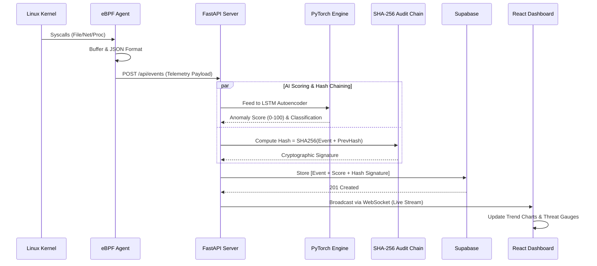
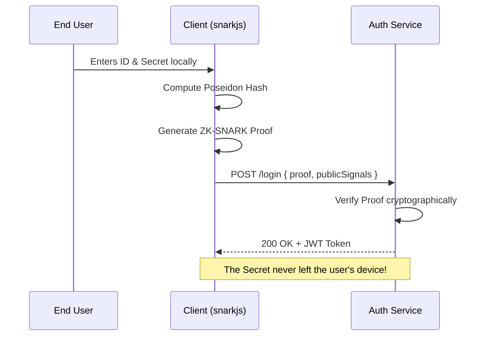

<div align="center">
  
  
  <h1 style="border-bottom: none;">AEGIS</h1>
  <h3>Zero-Trust AI Security & Infrastructure Platform</h3>

  <p align="center">
    <b>Next-Generation Threat Detection • Zero-Knowledge Authentication • Tamper-Proof Cryptography • 10-Layer AI Defense Pipeline</b>
  </p>

  <p align="center">
    
    
    
    
    
    
    
    
  </p>
</div>

---

## 📑 Table of Contents
1. [The Philosophy: Why AEGIS?](#-the-philosophy-why-aegis)
2. [Core Architecture](#-core-architecture)
3. [Deep Dive: System Components](#-deep-dive-system-components)
4. [Data Flow & Diagrams](#-data-flow--diagrams)
5. [Installation & Deployment](#-installation--deployment)
6. [AI Training Pipeline](#-ai-training-pipeline)
7. [Environment Configuration](#-environment-configuration)
8. [API Reference](#-api-reference)
9. [Development & Architecture Decisions](#-development--architecture-decisions)

---

## 🛡️ The Philosophy: Why AEGIS?

Modern enterprise environments are failing against zero-day exploits, credential theft, and insider threats. AEGIS was engineered from the ground up to eliminate these vulnerabilities by assuming **nothing is safe** (Zero-Trust). 

Where traditional cybersecurity fails, AEGIS thrives:
*   **Death to Signatures:** Antiviruses look for known bad files. AEGIS uses a local **PyTorch LSTM Neural Network** to understand your system's normal behavior. If an attacker uses a novel zero-day exploit, the statistical deviation immediately flags it as an anomaly.
*   **Death to Passwords:** Attackers steal passwords and hashes. AEGIS users authenticate via **Zero-Knowledge Proofs (ZK-SNARKs)**, mathematically proving they know their credential without ever transmitting it across the network.
*   **Death to Log Tampering:** Hackers delete logs to hide their tracks. AEGIS uses a **Cryptographic SHA-256 Hash Chain** (Write-Once-Read-Many). If a single event is deleted or modified in the database, the cryptographic chain is broken, instantly alerting administrators to the compromise.

### 🏢 Prime Use Cases
- **Cloud Infrastructure Monitoring:** Deploy the lightweight eBPF agent on Kubernetes nodes to monitor raw kernel syscalls with near-zero CPU overhead.
- **Financial & Healthcare Systems:** Guarantee strict regulatory compliance (HIPAA, SOC2) using the tamper-proof cryptographic audit log.
- **Zero-Trust Corporate Endpoints:** Monitor developer machines for rogue processes, unauthorized network sockets, and privilege escalation attacks.

---

## 🏗️ Core Architecture

AEGIS unifies four distinct, highly-complex computer science domains into a single resilient platform:

| Domain | Technology Stack | Purpose & Implementation | Key Files / Location |
|--------|-----------------|--------------------------|----------------------|
| **1. OS Kernel Telemetry** | eBPF + BCC + Python | Operates in kernel space. Intercepts file I/O, process execution (`execve`), and network connections invisibly. | `agent/agent.py` (eBPF hooks)<br>`agent/collector.py` |
| **2. Artificial Intelligence** | PyTorch LSTM & GNN | Behavioral anomaly detection (LSTM) and Lateral Movement detection (GNN). Detects zero-days and multi-hop network traversals. | `backend/ai/model.py`<br>`backend/gnn/graph_builder.py` |
| **3. Cryptography & ZK** | circom + snarkjs + PQC | Implements ZK-SNARKs for passwordless auth, tamper-evident hash chaining, and Post-Quantum Cryptography (Dilithium/Kyber). | `backend/crypto/audit_chain.py`<br>`backend/crypto/pqc.py` |
| **4. Enrichment & Response** | Python + Memory Forensics | 10-layer enrichment pipeline: Threat Intel, MITRE ATT&CK, Playbooks, Honeypots, Memory Forensics, and LLM Explanations. | `backend/intel/`<br>`backend/playbooks/` |
| **5. Web Command Center** | React 18 + FastAPI + WebSockets | High-performance dashboard featuring Live Event Feeds, Threat Intel panels, Playbook Managers, and a 10-feature unified status hub. | `frontend/src/pages/`<br>`backend/api/` |

---

## 🌟 Deep Dive: The V2.0 Ten-Layer Defense Pipeline

AEGIS v2.0 introduces a massive, multi-staged security enrichment pipeline. When a raw OS telemetry event is intercepted by the kernel, it is piped through these 10 distinct micro-engines in real-time before being broadcasted to the Command Center:

### 1. Threat Intel Feeds (O(1) Bloom Filters)
Instead of executing slow database queries for every network event, AEGIS loads millions of known-bad IPs and Domains (from Abuse.ch Feodo Tracker, URLhaus, and SSLBL) into an in-memory **Bloom Filter**. This allows for `O(1)` constant-time lookups to instantly flag Command & Control (C2) server connections.

### 2. MITRE ATT&CK Tagger
AEGIS contains a localized heuristic engine that maps raw kernel events to specific **MITRE ATT&CK** tactics and techniques. For example, if a `bash` process spawns `nc` (netcat), the engine automatically tags the event with `T1059.004` (Unix Shell) and `T1095` (Non-Application Layer Protocol).

### 3. Automated Playbooks & Action Ledger
AEGIS doesn't just alert; it defends. If an event exceeds a critical threat threshold (e.g., Score > 90), the Playbook Engine executes automated response actions (like `isolate_host`, `kill_process`, or `block_ip`). Crucially, every action is recorded in a cryptographic **Action Ledger** with an "Undo Payload," allowing SOC analysts to mathematically reverse any false-positive defensive action with one click.

### 4. Honeypot Deception Layer
To eliminate false positives, AEGIS deploys "canary" files and decoy network ports across the host system. Legitimate software has no reason to interact with these decoys. If a process opens a honeypot file, the threat score instantly spikes to 100, bypassing the AI, as it guarantees unauthorized snooping or ransomware activity.

### 5. Memory Forensics Scanner
When high-severity processes are detected, AEGIS automatically dumps the active memory regions mapping (`/proc/PID/mem`). It then runs a high-speed string scanner against **YARA-style signatures** to search for in-memory footprints of known malware (e.g., Metasploit payloads, Cobalt Strike beacons) that avoid writing to the hard drive.

### 6. LLM Alert Explainer (Ollama RAG)
Instead of forcing analysts to decipher raw hex dumps and syscall IDs, AEGIS connects to a local, air-gapped Large Language Model (like **Qwen 2.5 Coder** via Ollama). The backend automatically feeds the event metadata and MITRE tags into a prompt, generating a plain-English, 3-sentence explanation of *what* the attacker did, and *what* to do next.

### 7. UEBA (User & Entity Behavior Analytics)
While the PyTorch LSTM models the entire system, the UEBA engine builds individual profiles for *every specific user* using **Isolation Forests**. It tracks login times, typical process trees, and resource consumption to identify insider threats (e.g., an accountant suddenly running `nmap` at 3:00 AM).

### 8. GNN Lateral Movement Detection
Standard AI only looks at one computer at a time. AEGIS uses **Graph Neural Networks (NetworkX & PyTorch Geometric)** to build a multi-hop graph of network connections. It analyzes the "edges" (connections) between "nodes" (hosts) to detect an attacker pivoting through the network (Host A -> Host B -> Host C) in an abnormally short time window.

### 9. Privacy-Preserving Federated Learning
In enterprise environments, sending sensitive behavioral data from employee laptops to a central cloud is a privacy risk. AEGIS utilizes **Federated Learning (FedAvg)**. The AI model is trained locally on the endpoint. Only the mathematical *weight updates* (with Laplace noise added for **Differential Privacy**, ε=0.1) are sent to the central server, merging into a global "Hive Mind" model without ever exposing user data.

### 10. Post-Quantum Cryptography (NIST PQC)
To future-proof the audit logs against quantum computers running Shor's algorithm, the AEGIS Zero-Knowledge authentication and Hash Chains are dual-signed. AEGIS implements the NIST-approved **Dilithium** algorithm for digital signatures and **Kyber** for key encapsulation, ensuring data captured today cannot be decrypted by quantum computers tomorrow.

---

## 🔄 Data Flow & Diagrams

### 1. Unified Threat Detection & Audit Pipeline
The following sequence details how an OS event is captured, scored by AI, sealed in the hash chain, and broadcasted to the dashboard.



### 2. Zero-Knowledge Passwordless Auth


---

## 💻 Installation & Deployment

Deploying AEGIS locally is streamlined for testing, development, and research.

### Prerequisites
- Python 3.10+
- Node.js 18+
- A [Supabase](https://supabase.com/) project (Free tier works perfectly).

### Step 1: Clone & Prepare Environments
```bash
git clone https://github.com/yourusername/aegis.git
cd aegis
```

Create a `.env` file in the **`backend/`** directory:
```env
SUPABASE_URL=https://your-project.supabase.co
SUPABASE_KEY=your-anon-key
AUDIT_ENCRYPTION_KEY=generate_this_via_python_script
JWT_SECRET=a_very_long_secure_random_string
FRONTEND_URL=http://localhost:5173
```
*(Generate `AUDIT_ENCRYPTION_KEY` using: `python -c "from cryptography.fernet import Fernet; print(Fernet.generate_key().decode())"`)*

Create a `.env` file in the **`frontend/`** directory:
```env
VITE_API_URL=http://localhost:8000
VITE_WS_URL=ws://localhost:8000
VITE_SUPABASE_URL=https://your-project.supabase.co
VITE_SUPABASE_ANON_KEY=your-anon-key
```

### Step 2: Boot up the Backend (FastAPI + AI Engine)
```bash
cd backend
pip install -r requirements.txt
uvicorn main:app --reload --port 8000
```

### Step 3: Boot up the Frontend (React Dashboard)
```bash
cd frontend
npm install
npm run dev
```
Navigate to `http://localhost:5173` to access the Command Center.

### Step 4: Run the Telemetry Agent
To generate realistic OS data and simulate attacks on your dashboard, use the included Python simulator (perfect for Windows/Mac users without eBPF capabilities):
```bash
cd agent
python agent_sim.py --attack
```

---

## 🧠 AI Training Pipeline

By default, the backend falls back to rule-based threat scoring if an AI model isn't present. To unleash the full power of AEGIS, you must train the LSTM Neural Network on your machine's baseline telemetry.

1. Ensure your `agent_sim.py` and `backend` are both running so data is being collected.
2. Open a **new terminal** in the `backend/` directory.
3. **Download your collected telemetry** to use as baseline training data:
   ```bash
   python -c "import urllib.request; urllib.request.urlretrieve('http://localhost:8000/api/events/recent?limit=1000', '../baseline_events.json')"
   ```
4. **Train the LSTM Autoencoder:**
   ```bash
   python ai/trainer.py ../baseline_events.json
   ```
   *The system will process the sequences, train the PyTorch model for 100 epochs, and automatically save the `.pt` binary. The backend will instantly switch from rule-based scoring to AI predictions without requiring a restart!*

---

## 📡 API Reference

AEGIS exposes a clean REST API and a robust WebSocket interface.

| Category | Method | Endpoint | Description |
|----------|--------|----------|-------------|
| **Auth** | `POST` | `/api/auth/register` | Register identity using ZK public hash |
| **Auth** | `POST` | `/api/auth/login` | Authenticate using ZK-SNARK zero-knowledge proof |
| **Events** | `POST` | `/api/events` | Ingest bulk telemetry from eBPF agent |
| **Events** | `GET` | `/api/events/recent` | Retrieve latest cached system events (JSON array) |
| **Events** | `GET` | `/api/events/stats` | Aggregate dashboard statistics and threat ratios |
| **Audit** | `GET` | `/api/audit` | Fetch encrypted cryptographic audit logs |
| **Audit** | `GET` | `/api/audit/verify/chain` | Trigger a full mathematical validation on the SHA-256 chain |
| **Stream** | `WS` | `/ws/events` | Real-time bidirectional WebSocket event streaming |

---

## 📁 Repository Structure

```text
AEGIS/
├── agent/                    # Telemetry Collection Layer
│   ├── agent.py              # True eBPF BCC kernel hook script (Linux)
│   ├── agent_sim.py          # Cross-platform data & attack simulator
│   └── collector.py          # Ring-buffer telemetry aggregation
├── backend/                  # Application Logic Layer (The Brain)
│   ├── ai/                   # PyTorch LSTM Autoencoder (Baseline Anomaly Detection)
│   ├── api/                  # FastAPI REST & WebSocket controllers (10-layer middleware)
│   ├── crypto/               # ZK-proof verification, SHA-256 chaining & Post-Quantum Cryptography
│   ├── db/                   # Supabase PostgreSQL ORM & in-memory fallback
│   ├── federated/            # Federated Learning Server (Differential Privacy aggregation)
│   ├── forensics/            # Automated memory dumping (`/proc/PID/mem`) & YARA signature scanning
│   ├── gnn/                  # Graph Neural Network builder for Lateral Movement detection
│   ├── honeypot/             # Deception infrastructure manager (Decoy files, canary ports)
│   ├── intel/                # O(1) Bloom Filter Threat Feeds & MITRE ATT&CK Tagger
│   ├── llm/                  # RAG-based Alert Explainer connecting to local Ollama (Qwen)
│   ├── playbooks/            # Automated Response Engine & reversible Action Ledger
│   ├── ueba/                 # User & Entity Behavior Analytics (Isolation Forest profiling)
│   └── main.py               # Uvicorn entry point orchestrating all 10 modules
├── frontend/                 # Presentation Layer
│   ├── src/components/       # Real-time Threat Gauges, Recharts, Event Feeds
│   ├── src/hooks/            # useWebSocket & useZKAuth custom hooks
│   └── src/pages/            # Dashboard, Threat Intel, Playbooks, Features, and Auth interfaces
└── zk/                       # Zero-Knowledge Circuit Definitions
    └── circuit.circom        # Poseidon hash proving circuits (circom)
```

---

## 📜 License & Acknowledgements

This project is licensed under the **MIT License**.

Designed and engineered as an advanced cybersecurity platform showcasing the integration of deep learning, low-level kernel tracing, and applied cryptography. 

<div align="center">
  <br>
  <b>Built for a Zero-Trust World.</b>
</div>
